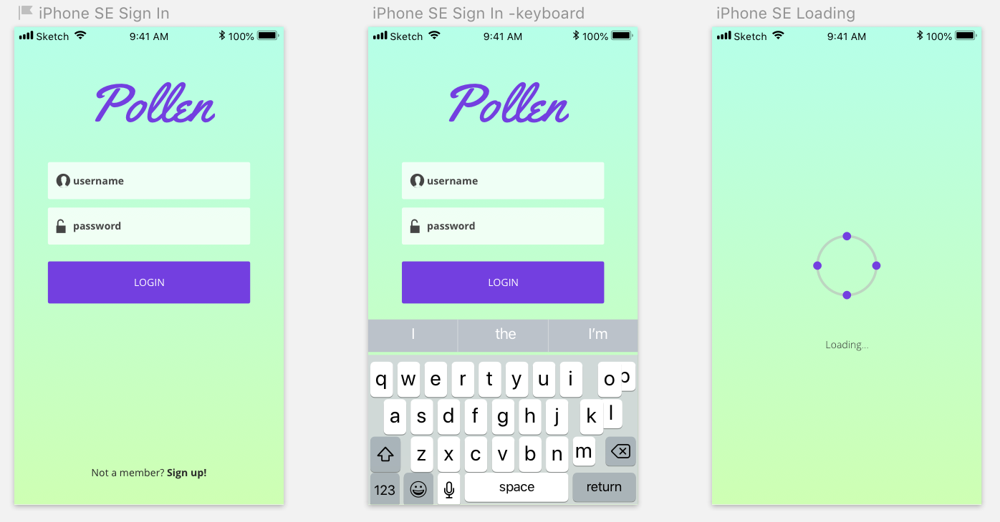
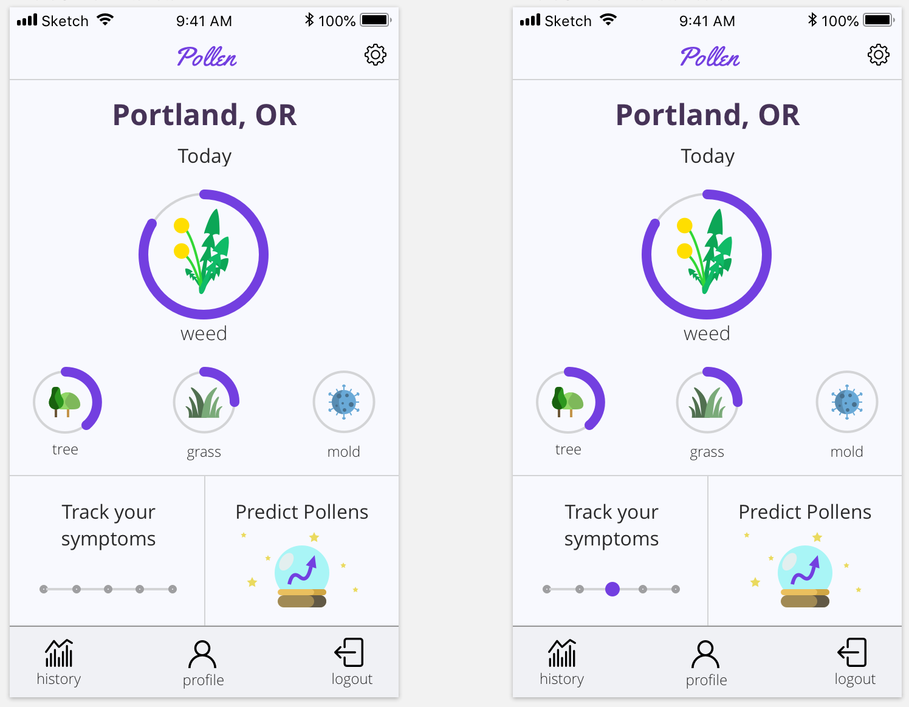
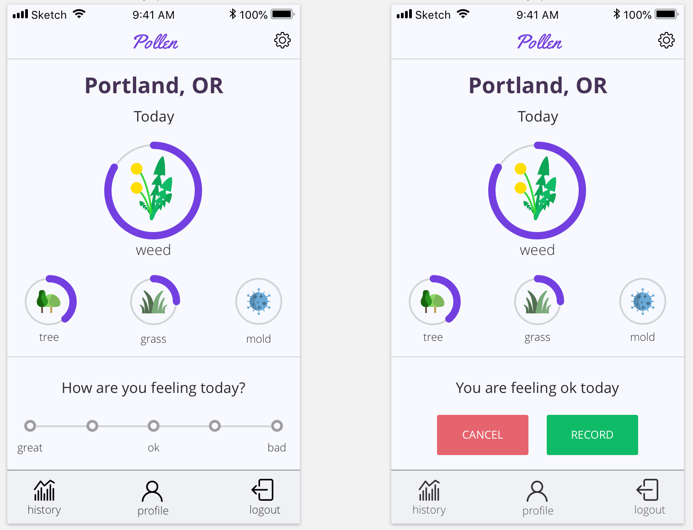
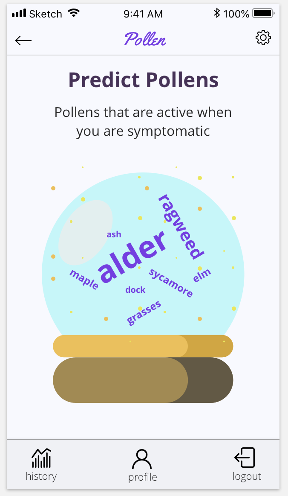
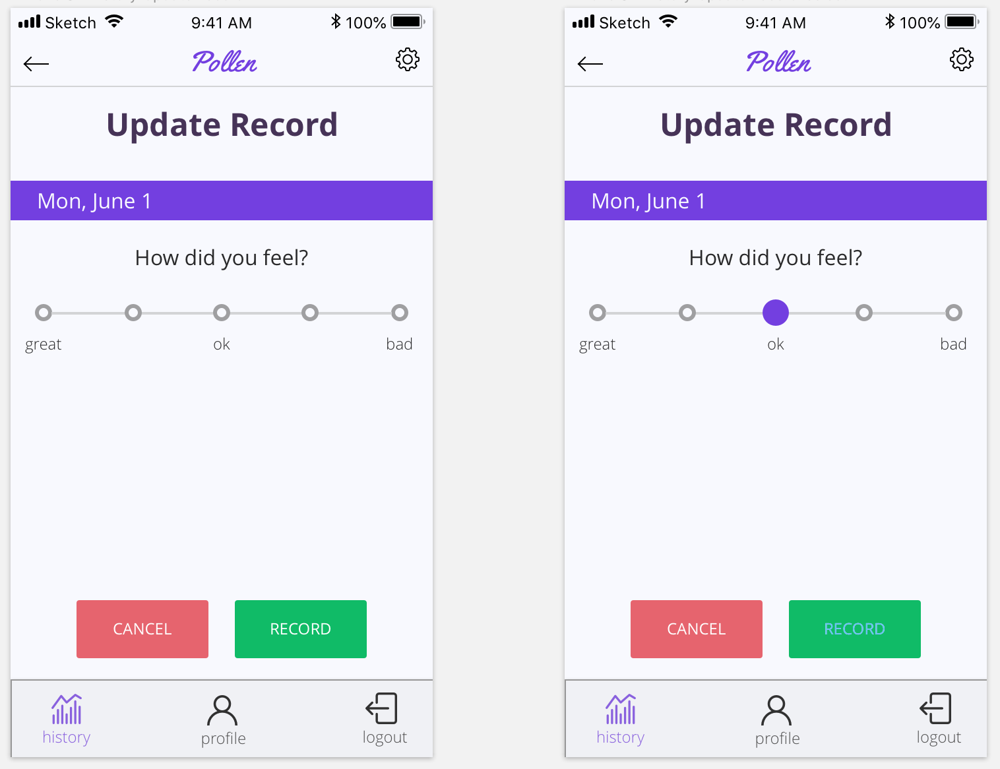
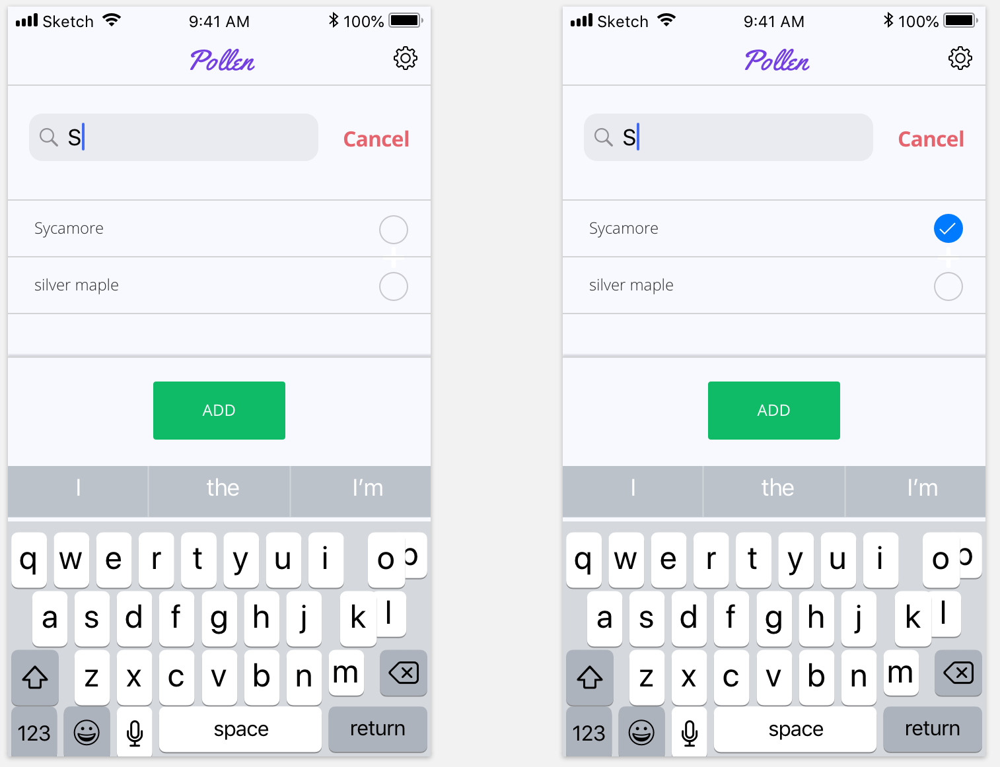

# Pollen Forecast
#### Capstone project for Epicodus.

#### By: **Brenda Franco**

## Description

This web application is designed to return the current pollen forecast and allow a user to track and view their symptoms over time.

This project will be built using React.

## Screenshots

### Design

View of Login page:  

View of Main page:  

View of a Specific Pollen detail Page:  

View of the daily symptom tracker:  

View of the Predict Pollen allergies page:  

View of History Main page:  

View of expanded history view (week):  

View of expanded history view (month):  

View of the record update page:  

View of the add allergy page:  

## User Stories
1. As a user, I want to be able to login to my account. (MVP)
2. As a user, I want to see an animated loading icon while my profile loads. (MVP)
3. As a user, I want to edit my location. (MVP)
4. As a user, I want to see the current pollen levels. (MVP)
5. As a user, I want to see the current details of particular pollen group. (MVP)
6. As a user, I want to see the details of the current pollen group to highlight pollens I am allergic too.
7. As a user, I want to create a profile that allows me to specify which pollens I know I'm allergic to.
8. As a user, I want the list of pollens to auto-populate.
9. As a user, I want to track my symptoms for the day. (MVP)
10. As a user, I want to add past symptoms for a given day. (MVP)
11. As a user, I want I want to see a graph of my symptoms over time and how it relates to specific pollen groups. (MVP)
12. As a user, I want the option to see my symptoms over the past month or the past 3 months.
13. As a user, I want to see a screen that shows the pollens most active during my tracking period. (MVP)

## Screens Required
* Login Screen.
  - Login Screen with keyboard
* Loading Screen
* Landing Page with Current Forecast. Has access to history, user profile, logout, and settings.
  - Pollen Detail Page. Shows pollen count breakdown for a specific group OR common pollens for the date.
  - Symptom tracker page that allows a user to track their daily symptoms.
    + Symptom Tracker View showing a user has recorded their symptoms for the day. Show option to re-record symptoms for the day.
  - User Profile Page. Allow user to add or remove known pollen allergies.
    + User profile page with auto-populated pollen field.
  - Settings page. Page that allows user to edit current location.
  - History landing page. Shows mini-graphs for a common allergy word cloud chart, and trend charts with user symptoms over time overlaid with pollen counts. Allows a user to select a graph to expand.
    + Expanded view of Word Cloud graph.
    + Expanded view of detailed graph with user symptoms. Under the graph, show the history of tracked symptoms and allow a user to edit, add, or remove a record.
      - Expanded view with 1 month of data.
      - Expanded view with 3 months data.
      - Expanded view of historical records.
        + View showing Add record
        + View showing modify existing record.
        + View showing delete exisitng record.

## Contact
Do not contact anyone with questions or comments regarding this project.

## License
Copyright (c) 2018 ****_Brenda Franco_****

Permission is hereby granted, free of charge, to any person obtaining a copy of this software and associated documentation files (the "Software"), to deal in the Software without restriction, including without limitation the rights to use, copy, modify, merge, publish, distribute, sublicense, and/or sell copies of the Software, and to permit persons to whom the Software is furnished to do so, subject to the following conditions:

The above copyright notice and this permission notice shall be included in all copies or substantial portions of the Software.
